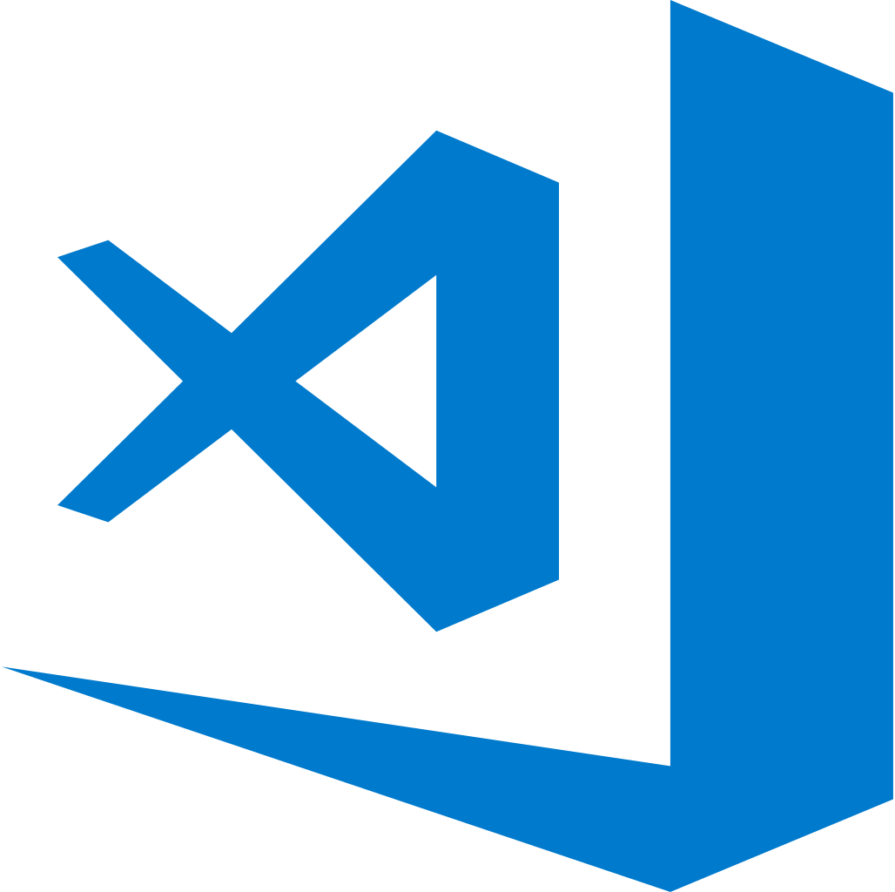

### Hi there 🤗

Welcome to my GitHub. My name is [**Mohammed EL-KHOU**](https://m-elkhou.github.io/) and I'm a Data Scientist and Ph.D. student at [Sidi Mohamed ben Abdellah University](http://www.usmba.ac.ma/) (USMBA) [Faculty of Sciences Dhar El Mahraz](http://www.fsdmfes.ac.ma/) (`FSDM`), Fez - Morocco, under the supervision of [Prof. Jamal RIFFI](https://scholar.google.com/citations?user=DPK9m_YAAAAJ&hl). Before that, I obtained my Master degree from [`FSDM` - `USMBA`](http://www.fsdmfes.ac.ma/). My major research interest lies in the intersection of *Data Sciences* and *Computer Vision*, as well as *Natural Language Processing*.

You can [contact me](mailto:m.elkhou@hotmail@.com) if you think we could work together on an article or a project, or if you have any question/remark. If you would like to get to know more about me and my projects, feel free to check out [my resume](https://drive.google.com/file/d/11Rcy_J3zfErbsgQcAbQGsLGP6zWf-wMf/view) or [my page](https://m-elkhou.github.io/).

Languages and Tools:

 
 

Library:

