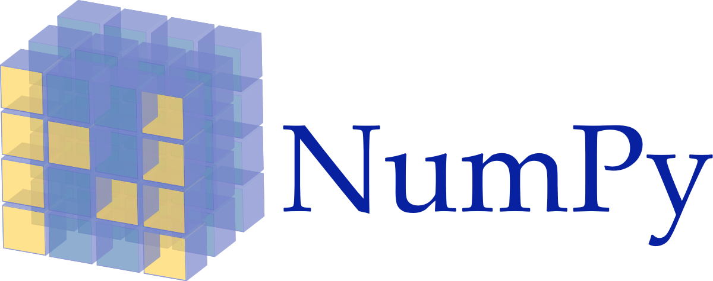

# Hi there 🤗👋, I'm Mohammed

<!--  -->

Welcome to my GitHub. My name is [**Mohammed EL-KHOU**](https://m-elkhou.github.io/) and I'm a Data Scientist and Ph.D. student at [Sidi Mohamed ben Abdellah University](http://www.usmba.ac.ma/) (`USMBA`) [Faculty of Sciences Dhar El Mahraz](http://www.fsdmfes.ac.ma/) (`FSDM`), Fez - Morocco, under the supervision of [Prof. Jamal RIFFI](https://scholar.google.com/citations?user=DPK9m_YAAAAJ&hl). Before that, I obtained my Master degree from [`FSDM` - `USMBA`](http://www.fsdmfes.ac.ma/). My major research interest lies in the intersection of *Data Sciences* and *Computer Vision*, as well as *Natural Language Processing*.

You can [contact me](mailto:m.elkhou@hotmail@.com) if you think we could work together on an article or a project, or if you have any question/remark. If you would like to get to know more about me and my projects, feel free to check out [my resume](https://drive.google.com/file/d/11Rcy_J3zfErbsgQcAbQGsLGP6zWf-wMf/view) or [my Portfolio  👨‍💻 ](https://m-elkhou.github.io/).

:zap: Github's Stats 

<table>
  <thead>
    <th></th>
    <th></th>
    <th></th>
  </thead>
</table>

<!-- ---

Languages and Tools

 -->

---

<table>
  <thead>
    <th>Languages</th>
    <td></td>
    <td></td>
    <td></td>
    <td></td>
    <td></td>
    <td></td>
    <td></td>
    <td></td>
    <td></td>
    <td></td>
  </thead>
  <tr>
    <th>Database</th> 
    <td></td>
    <td></td>
    <td></td>
    <td></td>
  </tr>
   <tr>
    <th>DevOps</th>
     <td></td>
     <td></td>
     <td></td>
     <td></td>
     <td></td>
     <td></td>
  </tr>
  <tr>
    <th>UI Design</th>
    <td></td>
    <td></td>
    <td> </td>
    <td> </td>
  </tr>
  <tr>
    <th>Cloud</th>
     <td> </td>
     <td> </td>    
  </tr>
  <tr> 
    <th rowspan="2">Data Science</th>
    <td></td>
    <td></td>
    <td></td>
    <td></td>
    <td></td> 
    <td></td>
    <td></td>
    </tr><tr>
    <td></td>
    <td></td> 
    <td></td> 
    <td></td> 
    <td></td> 
    <td></td> 
    <td></td>
    <td></td>
  </tr>
  <tr>
    <th>Frameworks</th>
    <td></td>
  </tr>
</table>

<!-- 

Library

 -->

Workstation

  
  
  
  

